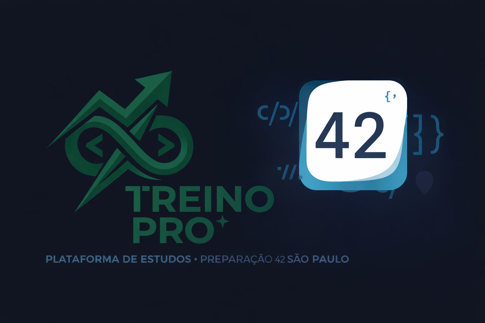

# Treino Pro - Extensão VSCode

<div align="center">
  
  <p><b>Pratique, Treine e Avance na Piscine da 42</b></p>
  
  [](#)
  [](#)
</div>

Extensão oficial do **Treino Pro** para treinar exercícios diretamente no VSCode. Esta extensão oferece validação de código em tempo real com Norminette, testes automatizados (integrados com Mini-Moulinette originária da 42), terminal dedicado unificado e integração com GitHub Copilot para produtividade máxima.

## Recursos Principais

### ✅ Validação Norminette Completa
- **20+ regras de Norminette**: Validação de indentação, espaçamento, nomenclatura de variáveis (prefixos `s_`, `e_`, `u_`, `g_` e sufixo `_t`)
- **Detecção de erros em tempo real**: Análise instantânea enquanto você digita
- **Sugestões de correção automática**: Quick fixes para corrigir erros comuns
- **Verificação de comprimento de linhas**: Máximo de 80 caracteres por linha
- **Validação de include guards**: Detecção correta de proteção contra inclusão dupla

### 🧪 Testes Automatizados & Mini-Moulinette
- **40+ exercícios testáveis**: Suporte completo para múltiplos tipos de exercício (C00 ao C13).
- **Integração com Mini-Moulinette**: Verificações sequenciais robustas com detecção visual de falhas via "Expected X got Y".
- **Validação de protótipos**: Verifica se as funções têm assinatura correta.
- **Memory leak detection**: Verificação automática com Valgrind (Linux/Mac).
- **Compilação com flags obrigatórias**: `-Wall -Wextra -Werror`
- **Testes parametrizados**: Múltiplos casos de teste por função.

### 🚀 Terminal Webytehub 42 (Novo!)
A extensão agora injeta rotinas consolidadas no VS Code integrando sua shell!
- **Workspace Pré-Carregado**: Use `Treino Pro: Abrir Terminal Webytehub 42` (Ctrl+Shift+P).
- **Único Comando**: Basta rodar `webytehub -42` e nós executaremos uma auditoria de estilo (Norminette) conectada ponta a ponta com a aprovação em massa da sua Bateria de Testes (`mini-moulinette`).

### 🤖 Integração GitHub Copilot
- **Chat Participant `@norm`**: Comando dedicado para perguntas sobre Norminette
- **/fix**: Correção automática de erros sugerida por IA
- **/explain**: Explicação detalhada de erros e problemas
- **/optimize**: Sugestões de otimização de código
- **Contexto de código**: Copilot tem acesso ao código do seu arquivo

### 🖥️ Suporte Multiplataforma
- **Linux**: Suporte completo com Valgrind, GCC e Clang
- **macOS**: Detecção automática de ferramentas via Homebrew
- **Windows**: Suporte via WSL2 com detecção automática de binários
- **Detecção automática**: Identifica automaticamente ferramentas disponíveis no sistema

### 🔧 Ferramentas Integradas
- **Compilador em tempo real**: Detecção de erros de compilação antes de submeter
- **Analisador de indentação**: Verifica espaços vs tabs (sempre espaços)
- **Verificador de nomes**: Validação de nomenclatura de variáveis e funções
- **Detector de profundidade de aninhamento**: Máximo de 25 níveis

## Instalação

### Via VSCode Marketplace
1. Abra VSCode
2. Vá para Extensions (Ctrl+Shift+X / Cmd+Shift+X)
3. Procure por "Treino Pro"
4. Clique em "Install"

### Requisitos do Sistema
- **VSCode** 1.85.0 ou superior
- **Node.js** 18+ (para compilação da extensão)
- **GCC** ou **Clang** (para compilação de código C)
- **Valgrind** (opcional, para detecção de memory leaks no Linux/Mac)

#### Linux
```bash
# Ubuntu/Debian
sudo apt install build-essential valgrind

# Fedora
sudo dnf install gcc clang valgrind
```

#### macOS
```bash
# Via Homebrew
brew install gcc clang valgrind
```

#### Windows (WSL2)
```bash
# Na distribição WSL
sudo apt install build-essential
# Valgrind não está oficialmente suportado no WSL, mas você pode usar ferramentas alternativas
```

## Como Usar

### Abrir Painel de Exercícios
```
Ctrl+Shift+P (ou Cmd+Shift+P no Mac) → "Treino Pro: Abrir Painel"
```

### Carregar um Exercício
1. Clique na aba "Treino Pro" na barra lateral
2. Selecione um exercício na lista "Exercícios"
3. Clique em "Carregar" para criar o arquivo template

### Verificar Norminette
```
Ctrl+Shift+N (ou Cmd+Shift+N) → Verifica o arquivo atual
```

Ou clique no botão "Verificar Norminette" na barra superior do editor.

### Compilar e Testar
```
Ctrl+Shift+T (ou Cmd+Shift+T) → Compila e executa testes
```

### Usar Copilot para Ajuda
```
Ctrl+Shift+P → "Chat"
@norm /fix → Copilot sugere correções
@norm /explain → Explica o erro em detalhes
```

### Ativar Modo de Correção Automática
Na primeira detecção de erro, clique em "Quick Fix" (💡) para ver sugestões:
- Converter tabs para espaços
- Adicionar espaço após `if`, `while`, etc.
- Remover espaços desnecessários
- Ajustar comprimento de linhas

## Configurações

Abra `Preferences → Settings` e procure por "Treino Pro":

```json
{
  "treinoPro.enableNorminnetteFix": true,
  "treinoPro.enableCopilotIntegration": true,
  "treinoPro.checkMemoryLeaks": true,
  "treinoPro.realTimeValidation": true,
  "treinoPro.maxLineLength": 80,
  "treinoPro.maxNestingDepth": 25,
  "treinoPro.showNorminetteOnSave": true,
  "treinoPro.autoSave": true,
  "treinoPro.workspacePath": "/path/to/exercises"
}
```

## Estrutura de Arquivos

```
vscode-extension/
├── src/
│   ├── extension.ts              # Ponto de entrada
│   ├── services/
│   │   ├── platformService.ts    # Detecção multiplataforma
│   │   ├── norminetteService.ts  # Validação Norminette
│   │   ├── moulinetteService.ts  # Testes Moulinette
│   │   ├── copilotService.ts     # Integração Copilot
│   │   ├── compilerService.ts    # Compilação
│   │   ├── diagnosticsService.ts # Diagnósticos unificados
│   │   └── index.ts              # Exports
│   ├── providers/
│   │   ├── exercisesProvider.ts  # Painel de exercícios
│   │   ├── toolsProvider.ts      # Painel de ferramentas
│   │   ├── codeActionsProvider.ts# Quick fixes
│   │   └── index.ts              # Exports
│   └── types/
│       └── index.ts              # Types compartilhados
├── package.json
├── tsconfig.json
└── README.md
```

## Troubleshooting

### "Norminette não encontrada"
- Linux/Mac: Instale com `pip3 install norminette`
- Windows (WSL): Execute norminette dentro do WSL
- Configuração manual: `treinoPro.workspacePath` nas settings

### "Valgrind não disponível"
- Esta ferramenta é opcional
- Linux: `sudo apt install valgrind`
- macOS: `brew install valgrind`
- Windows: Use WSL ou ferramentas alternativas

### "GCC não encontrado"
- Linux: `sudo apt install build-essential`
- macOS: `xcode-select --install`
- Windows: Configure WSL2 ou MinGW

### "Copilot não está respondendo"
- Certifique-se de ter GitHub Copilot instalado
- Faça login com sua conta GitHub
- Verifique se o Chat está ativo em VSCode

## Desenvolvendo a Extensão

```bash
# Clonar repositório
git clone https://github.com/treino-pro/vscode-extension.git
cd vscode-extension

# Instalar dependências
npm install

# Compilar TypeScript
npm run compile

# Assistir mudanças
npm run watch

# Empacotar para distribuição
npm run package
```

## Contribuindo

1. Faça um Fork do repositório
2. Crie uma branch para sua feature (`git checkout -b feature/amazing`)
3. Commit suas mudanças (`git commit -m 'Add amazing feature'`)
4. Push para a branch (`git push origin feature/amazing`)
5. Abra um Pull Request

## Recursos Adicionais

- [Norminette Official Rules](https://github.com/42school/norminette)
- [42 School Piscine](https://www.42.fr/)
- [VSCode Extension API](https://code.visualstudio.com/api)
- [GitHub Copilot Docs](https://github.com/features/copilot)

## Licença

MIT License - veja LICENSE para detalhes

## Suporte

Encontrou um bug? Abra uma issue no [GitHub](https://github.com/treino-pro/vscode-extension/issues)

## Changelog

### v1.1.0 (Em Desenvolvimento)
- ✅ PlatformService multiplataforma
- ✅ 20+ regras de Norminette
- ✅ CodeActionsProvider com quick fixes
- ✅ Chat Participant do Copilot
- ✅ 40+ exercícios testáveis
- ✨ Suporte melhorado para WSL

### v1.0.0
- 🎉 Lançamento inicial
- Validação básica de Norminette
- Testes com Moulinette
- Painel de exercícios

---

**Desenvolvido com ❤️ para a plataforma Treino Pro**
